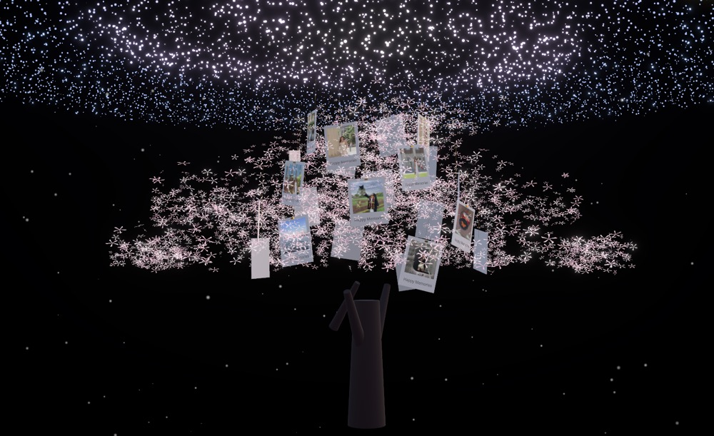

# 🌸 Interactive AI Cherry Blossom: Under the Galaxy

<p align="center">
  
</p>

> Transforming interactive holiday magic into a vision of renewal - this project reimagines the original emerald-and-gold luxury Christmas tree as a Cherry Blossom illuminated beneath the galaxy.  
>  
> 🌸 Cherry blossoms represent new beginnings, energy, and growth for 2026.

---

**About**

This project is a showcase of how AI-assisted development—guided by clear creative intent—can manifest complex ideas as immersive, interactive 3D web experiences.  
Leveraging React Three Fiber, TypeScript, and more, it turns imagination into reality, blending advanced technical systems with evocative, beautiful visuals.


## 📝 Prompt

Gemini 3 in Google AI Studio and Claude 4.5 Sonnet in Cursor:

```
Role: You are an expert 3D creative developer skilled in React 19, TypeScript, and Three.js (React Three Fiber).

Goal: Build a high-fidelity 3D web application called
“Grand Luxury Interactive Christmas Tree”.

Visual Style:
- Trump-style luxury aesthetic
- Deep emerald green + metallic gold
- Cinematic glow and bloom effects

Tech Stack:
- React 19
- TypeScript
- React Three Fiber
- Drei
- Postprocessing
- Tailwind CSS

Core Architecture:
- State Machine with two modes:
  - CHAOS: elements scattered in space
  - FORMED: elements assemble into a tree
- Dual-Position System:
  - ChaosPosition: random spherical coordinates
  - TargetPosition: cone-shaped Christmas tree
- Smooth interpolation (LERP) between states in useFrame

Key Systems:
- Foliage: massive particle system using THREE.Points + custom shaders
- Ornaments: instanced meshes with weighted physical “pull”
- Bloom post-processing for golden glow
- Polaroid-style photo decorations embedded in the tree
- Webcam-based hand gesture detection:
  - Open hand → unleash chaos
  - Closed fist → restore tree
  - Hand movement controls camera view

```

## 🛠️ Installation

1. **Clone the repository:**
   ```bash
   git clone https://github.com/sirui-luo/interactive-ai-cherry-blossom.git
   cd interactive-ai-cherry-blossom
   ```

2. **Install dependencies:**
   ```bash
   npm install
   ```

3. **Run the development server:**
   ```bash
   npm run dev
   ```
   
   > 📝 Note: Local dev mode uses localStorage for sharing (works in same browser only)
   > For full cloud sharing, see step 4

4. **Configure Cloudflare (Optional - for cloud sharing):**
   - Follow the detailed guide in `cloudflare-setup.md`
   - Copy `env.example` to `.env.local` and fill in your Cloudflare credentials
   - Use `npm run dev:vercel` to test with full Vercel environment

5. **Open your browser:**
   - Navigate to `http://localhost:3010/`
   - Allow camera access for gesture control
   - Click "Upload Photos" to upload your photos


## 🎯 Usage

### Photo Upload & Sharing

1. **Upload Photos:**
   - Click "Upload Photos" button to select up to 22 images
   - Photos will appear as polaroids on the Christmas tree

2. **Generate Share Link:**
   - After uploading photos, click "Generate share link"
   - Wait 2-3 seconds for the upload to complete
   - Copy the generated link and share with friends

3. **View Shared Photos:**
   - Friends can open the share link in any browser
   - Photos will automatically load on the Christmas tree
   - No login or app installation required
   - Links expire after 30 days

### Gesture Controls

1. **Position your hand** in front of the webcam (visible in top-right preview)
2. **Move your hand** to control the camera angle:
   - Left/Right: Horizontal rotation
   - Up/Down: Vertical tilt
3. **Open your hand** (spread all fingers): Unleash chaos mode
4. **Close your fist**: Restore tree to formed mode

### Mouse Controls

When no hand is detected, you can:
- **Click and drag** to rotate the view
- **Scroll** to zoom in/out
- **Right-click and drag** to pan (disabled by default)

## 🏗️ Tech Stack

### Frontend
- React 19 with TypeScript
- React Three Fiber (R3F) for 3D rendering
- Three.js for WebGL graphics
- @react-three/drei for helpers
- @react-three/postprocessing for visual effects
- MediaPipe for hand gesture detection
- Tailwind CSS for styling

### Backend (Photo Sharing)
- Vercel Serverless Functions
- Cloudflare R2 (S3-compatible object storage)
- Cloudflare KV (key-value storage)
- AWS SDK S3 Client for R2 integration

### Features
- Hand gesture control via webcam
- Dynamic state transitions (CHAOS ↔ FORMED)
- Photo upload and cloud sharing
- Temporary share links (30-day expiration)
- Instanced rendering for performance
- Bloom and post-processing effects
